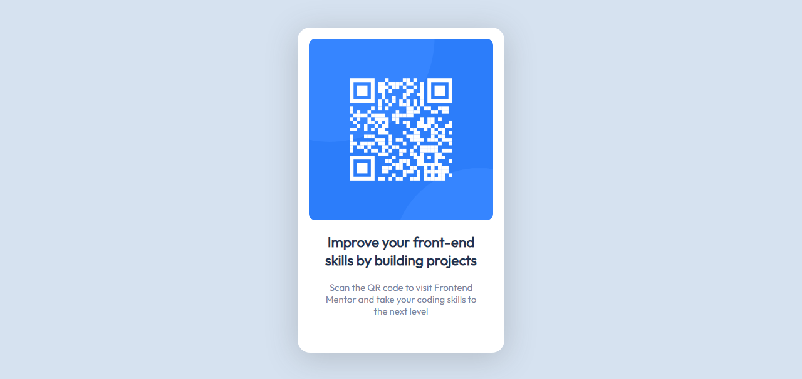

# Frontend Mentor - QR code component solution

## Table of contents

- [Frontend Mentor - QR code component solution](#frontend-mentor---qr-code-component-solution)
  - [Table of contents](#table-of-contents)
  - [Welcome! 👋](#welcome-)
  - [Overview](#overview)
    - [Screenshot](#screenshot)
    - [Links](#links)
    - [Built with](#built-with)
    - [What I learned](#what-i-learned)
    - [Useful resources](#useful-resources)
  - [Author](#author)

## Welcome! 👋

Thanks for checking out this front-end coding challenge.

This is a solution to the [QR code component challenge on Frontend Mentor](https://www.frontendmentor.io/challenges/qr-code-component-iux_sIO_H). Frontend Mentor challenges help you improve your coding skills by building realistic projects.

## Overview

### Screenshot



### Links

- Solution URL: [URL to solution](https://github.com/jayamon99/qr-code-component)
- Live Site URL: [Live site URL](https://jayamon99.github.io/qr-code-component/)

### Built with

- Semantic HTML5 markup
- CSS custom properties
- Flexbox

### What I learned

I learnt how to use CSS Flexbox, CSS Units and  all that there is to learn under it. I also learnt how to add fonts to webpages using font-face.

```html
<div class="img-container">
        
      </div>
```

```css
.container {
  align-items: center;
  display: flex;
  height: 100%;
  justify-content: center;
}
```

### Useful resources

- [W3Schools](https://www.w3schools.com/css/default.asp) - This helped me grasp CSS concepts. I really liked how clearly the concepts were explained and will use it going forward.

## Author

- Website - [Quaye Henry](https://github.com/jayamon99)
- Frontend Mentor - [@jayamon99](https://www.frontendmentor.io/profile/jayamon99)
